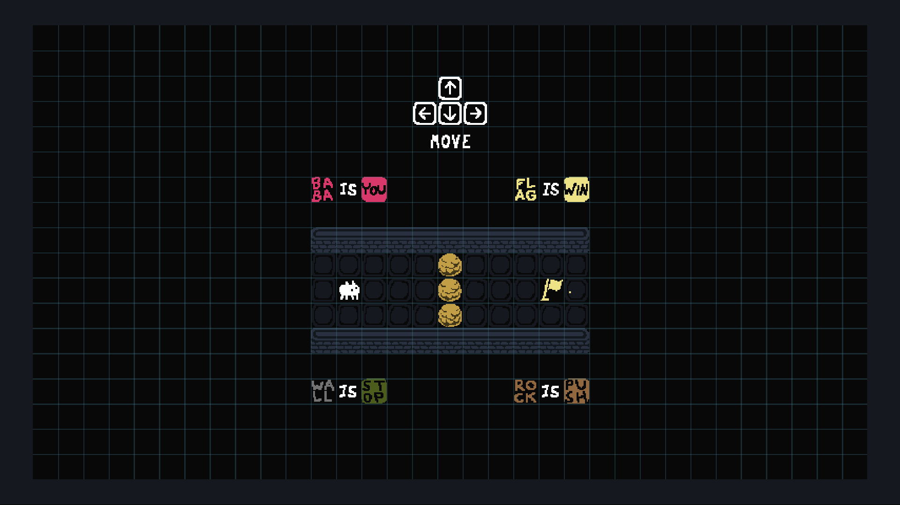
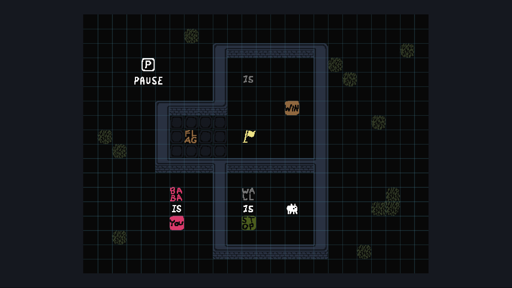
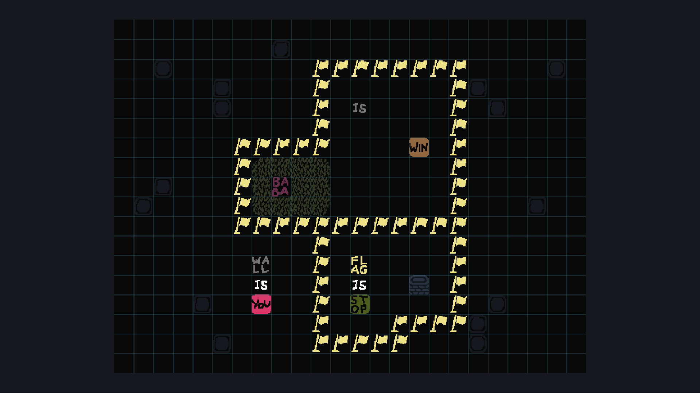
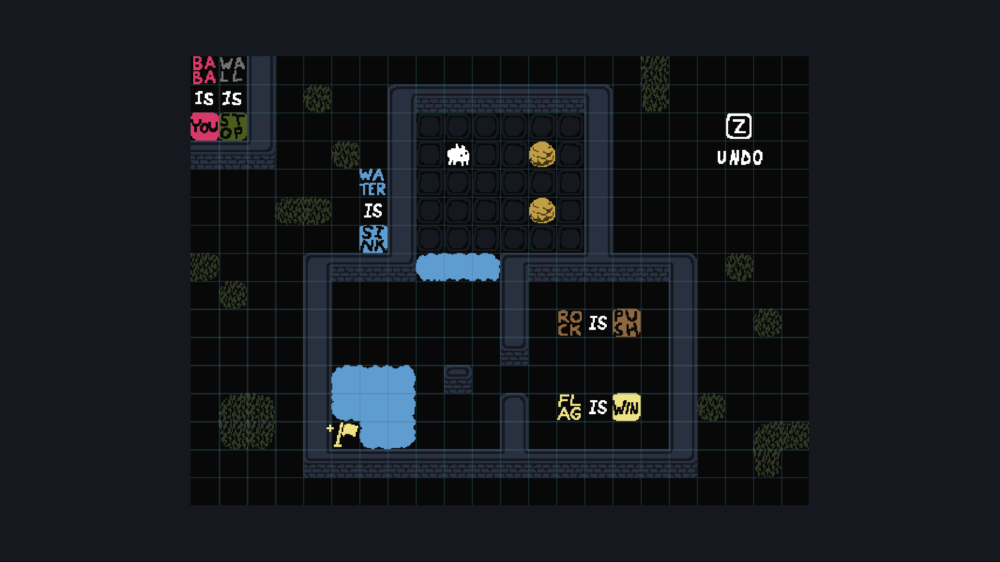
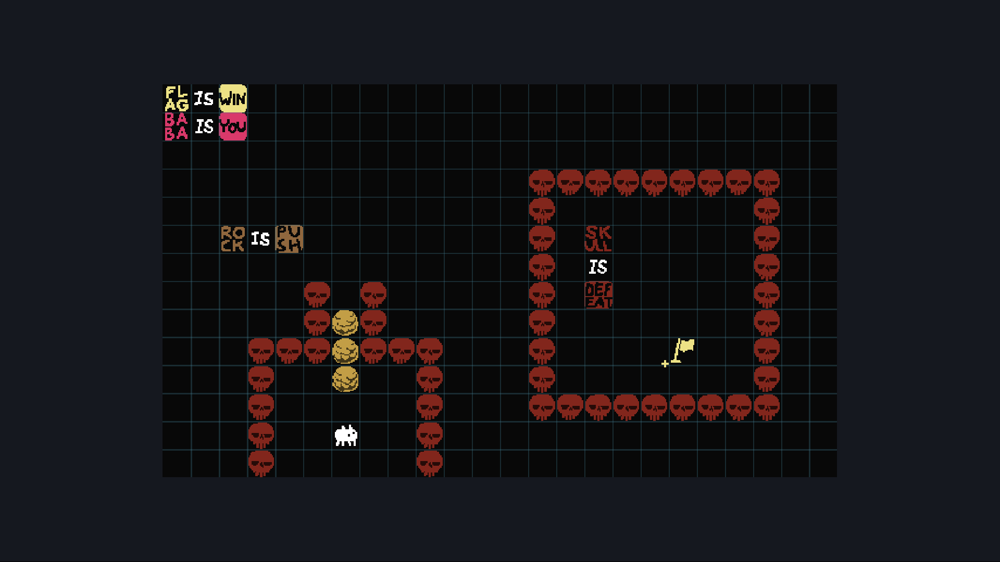
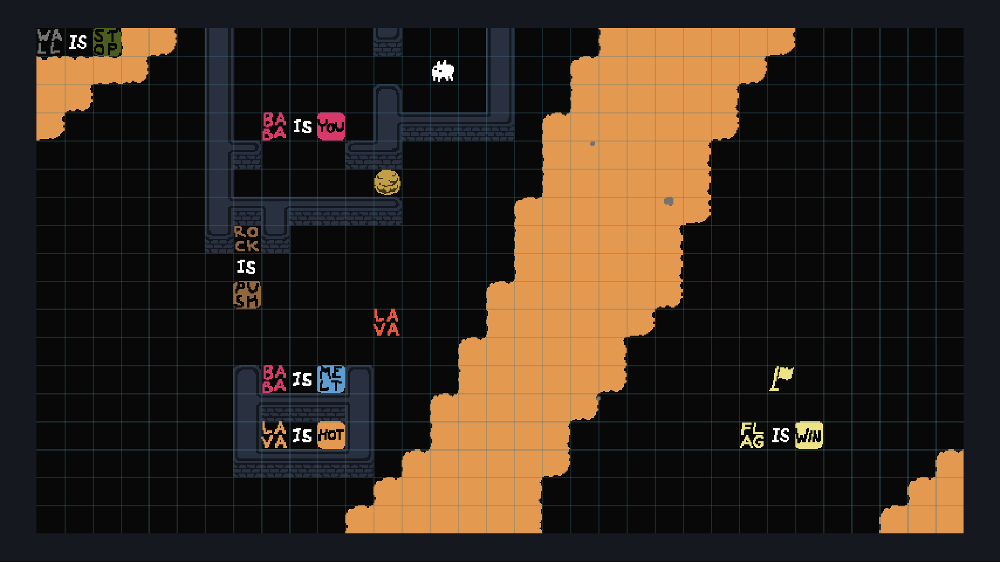
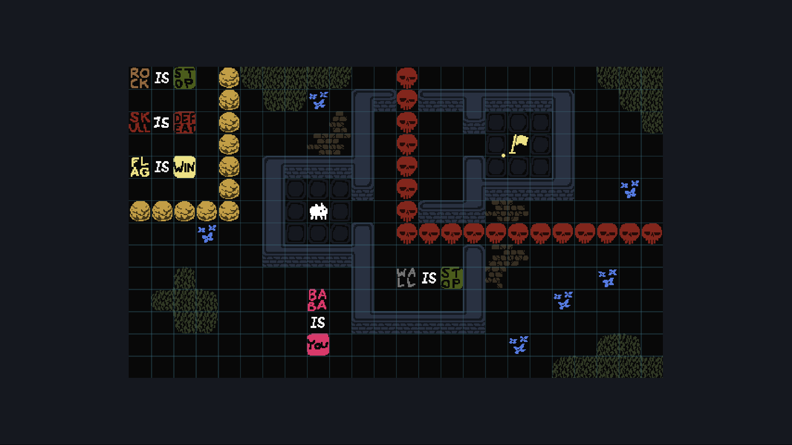
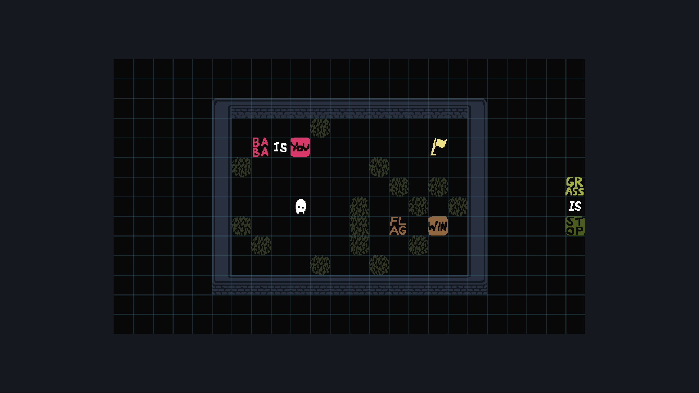

# Overworld

These first few levels probably have many different solutions due to their nature.

## 0: BABA IS YOU

   
Solution

    Go to the flag :)

## 1: WHERE DO I GO?

   
Solution

    Break `WALL IS STOP` and make `FLAG IS WIN`.

## 2: NOW WHAT IS THIS?

   
Solution

   Break `FLAG IS STOP` and make `FLAG IS WIN`.

## 3: OUT OF REACH

Introduction to `SINK`.

   
Solution

   Push rock into first water, make `ROCK IS WIN`, break `ROCK IS PUSH`.

## 4: STILL OUT OF REACH

Introduction to `DEFEAT`.

   
Solution

   Push text blocks or rocks into `SKULL IS DEFEAT`, breaking it.

   > Takeaway: DEFEAT only kills YOU but not anything else.

## 5: VOLCANO

   
Solution

   Make `LAVA IS MELT`.

## 6: OFF LIMITS

   
Solution

   Break `WALL IS STOP`, make `WALL IS BABA`.
   
   > Takeaway: Multiple things can be YOU!

## 7: GRASS YARD

   
Solution

   Wall is not stop! Make `FLAG IS WIN` and `BABA IS YOU` in a t-shape.

   > Takeaway: Text can be reused for multiple rules!

